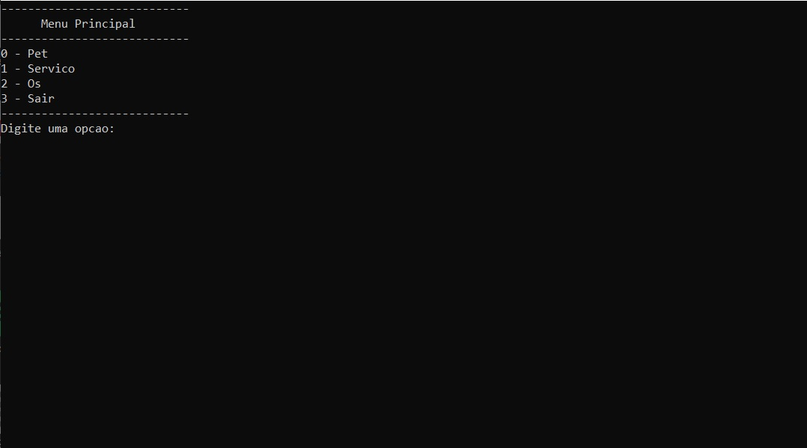
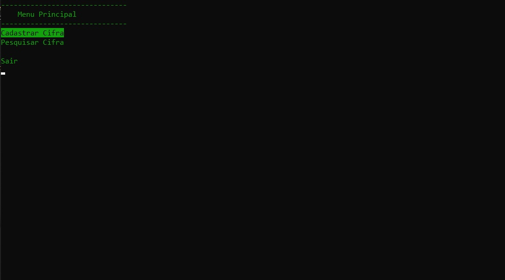

# Menu-navegavel-pelas-setas
Telas com menus navegáveis pelas setas do teclado - C++

O conceito destas classes é imaginar um menu interativo como uma matriz (bidimensional) de opções a serem escolhidas. A forma de navegar pelas setas é bem intuitiva. Isso elimina os menus que esperam o usuário digitar uma opção de entrada, dando mais dinamismo à aplicação.

  <figcaption> Menu Comum </figcaption>
  

                              

  <figcaption> Menu Interativo </figcaption>
  

## Funcionamento
A melhor forma de entender como essa classe funciona é olhar como ela é aplicada em um projeto, ou seja, a forma como outras classes herdam a classe 'Tela'. Isso você pode observar no repositório ..... Porém vale ressaltar o que o atributo 'int rastreioDeOpt' da classe 'Tela' representa.

O atributo 'int rastreioDeOpt' serve para indicar qual a função de cada opção. Por exemplo: 

	-----------------
	Pessoa           
	-----------------
	nome:
	sexo:
	    []masculino
	    []feminino
	voltar
	-----------------
  
  As opções 'nome', 'sexo', '[ ]masculino', '[ ]feminino' e 'voltar' são de tipos diferentes.
  
- 'nome' - espera-se que o usuário digite algo ao selecionar esta opção; 
- 'sexo' - espera-se que o usuário selecione outras opções ao selecionar esta opção;  
- '[ ]masculino' - espera-se que o usuário selecione após ter selecionado uma opção como a anterior ('sexo');  
- '[ ]feminino' - Idem;  
- 'voltar' - ao selecionar esta opção, o usuário é levado para outra tela;

Foi-se feita então a seguinte classificação:

Tipos:
- (1) Opções que possuem algum dado de entrada;
- (11) Resposta do dado de entrada. Porém, ao adicionar uma opção do tipo (1), este tipo é incrementado automaticamente;
- (2) Opções que selecionam algum elemento na tela;
- (21) Flag para indicar que do lado esquerdo existe uma opção do tipo (2);
- (3) Opções que são selecionadas pelas opções do tipo (2);
- (4) Opções que levam à alguma tela;
